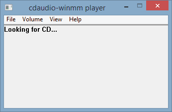

# cdaudio-winmm player (beta v.0.3):

0.3 changes:
- mp3/wav support
- cleared up some naming inconsistency

This is a very preliminary version of a winmm wrapper to separate cdaudio player that handles the track repeat and volume control that is broken on Windows Vista and onwards.

Unlike the ogg-winmm wrapper which plays ripped .ogg files it instead tries to play the cdtracks on a physical disc (or cd image?) using a separate player program.

The trick is to handle the broken MCI mode change by monitoring POSTION and MODE. 
If MODE = "playing" and POSITION has not changed then we can determine that the track has finished playing and can send the MM_NOTIFY_SUCCESSFUL message. The cdaudio player code might be useful for anyone wanting to write a MCI cdaudio player on newer Windows systems.

Since the cdaudio player is a separate program it's volume can be adjusted from the Windows mixer or the GUI of the player. It also includes an .ini file for storing the music volume setting.

Many MCI commands are still missing from the wrapper so games that use anything other than the default and most basic commands will not work. For example time format changes and track length calculations are missing.

So far tested to work with the following games:
- Civilization II: Test of Time
- Incoming (Rage Software, 1998)
- Pandemonium!
- WinQuake demo

Does not work with:
- Battlezone 2
- Heavy Gear

# Building:

Build with make.cmd if path variables are set (C:\MinGW\bin).
Or build from msys with command: mingw32-make

# Usage:

- Place winmm.dll wrapper into the game folder.
- Place cdaudioplr.exe in 'mcicda' -sub-folder.
- Run the game normally.

NOTE:
- You can start cdaudioplr.exe manually before running the game. Sometimes this may be necessary since the game may query the cd device before the wrapper has time to initialize the player.
- Do not place cdaudioplr.exe and winmm.dll in the same folder!
- v.0.3 now supports mp3 and wav playback if a music folder is found containing the tracks in the correct format. (track02.mp3/wav ...)
